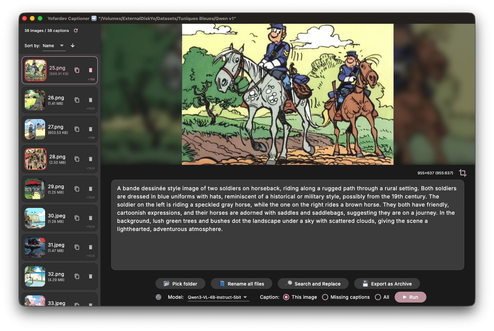

# Yofardev Captioner (MacOS, Linux & Windows)

An open-source desktop application for managing and captioning image files.



# Project Overview

This is a Flutter desktop application for MacOS, Linux, and Windows that allows users to manage and caption image files. The application provides a user interface to select a folder of images, view them one by one, and add/edit captions for each image. The captions are saved as `.txt` files with the same name as the image.

The application uses a third-party API for generating captions automatically. The user can configure the API endpoint, model, and API key in the application settings.

## Features

- **View and Manage Images**: Select a folder and view images one by one.
- **Edit Captions**: Add, edit, and save captions for each image. Captions are saved as `.txt` files.
- **Automatic Captioning**: Use a third-party API to automatically generate captions for your images.
- **Image Operations**: Crop and resize images.
- **Search and Replace**: Batch search and replace text in captions.
- **Sort and Filter**: Sort images by name, date, or caption length.


## Run on Desktop

For MacOS & Linux, directly download the latest version of the app in [Releases](https://github.com/YofarDev/yofardev_captioner_flutter/releases/).

## Build & Run with Flutter

To run this application, ensure you have Flutter installed.

1. Clone the repository:

   ```bash
   git clone https://github.com/YofarDev/yofardev_captioner_flutter.git
   cd yofardev_captioner_flutter
   ```
2. Get dependencies:

   ```bash
   flutter pub get
   ```
3. Run the application:

   ```bash
   flutter run
   ```
