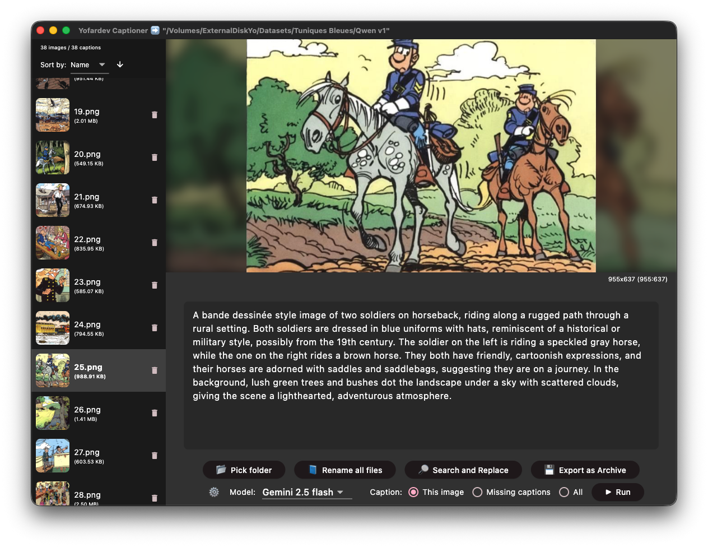

# Yofardev Captioner

A desktop application for managing and captioning image files.



## Run on Desktop

For MacOS, directly download the latest version of the app in [Releases](https://github.com/YofarDev/yofardev_captioner_flutter/releases/).

For Windows & Linux :

## Build & Run with Flutter

To run this application, ensure you have Flutter installed.

1. Clone the repository:
   ```bash
   git clone https://github.com/your-username/yofardev_captioner.git
   cd yofardev_captioner
   ```

2. Get dependencies:
   ```bash
   flutter pub get
   ```

3. Run the application:
   ```bash
   flutter run
   ```